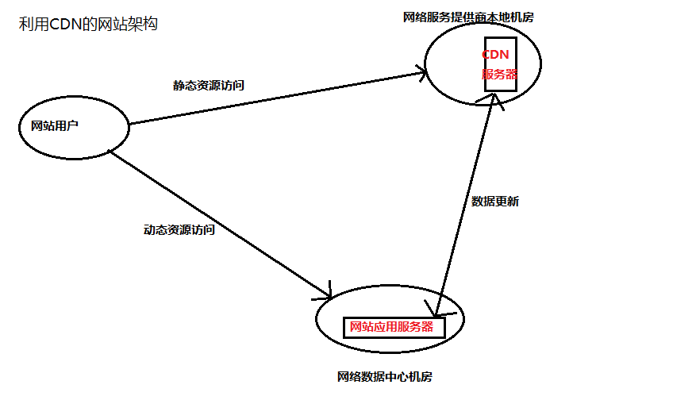
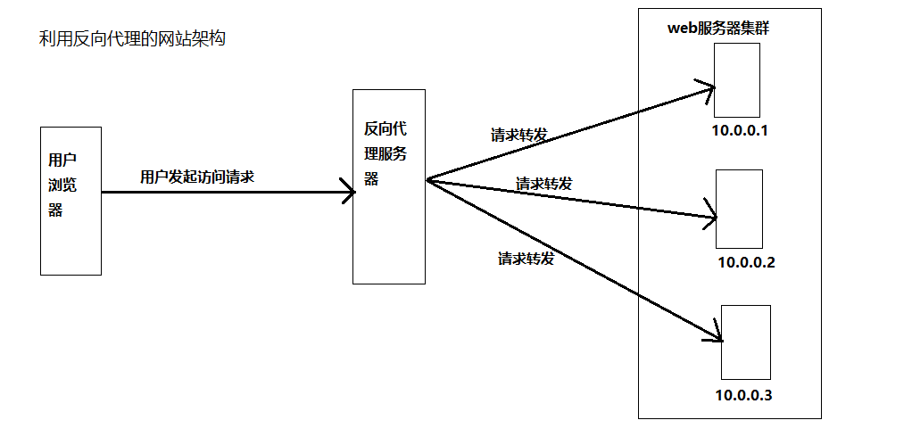

# 性能优化

## 减少http请求

减少http的主要手段是合并CSS、合并javascript、合并图片

## 合理利用缓存

## 代码压缩

## Lazyload image

## css放在页面头部，js放在底部

## 减少cookie传输

尽量减少cookie中传输的数据量。比如对于某些静态资源的访问，如CSS、script等，发送cookie没有意义，可以考虑静态资源使用独立域名访问，避免请求静态资源时发送cookie，减少cookie传输次数。

## 代码优化

分为js和css的代码优化

## CDN

CDN（contentdistribute network，内容分发网络）

## 反向代理

传统代理服务器位于浏览器一侧，代理浏览器将http请求发送到互联网上，而反向代理服务器位于网站机房一侧，代理网站web服务器接收http请求。如下图所示：

论坛网站，把热门词条、帖子、博客缓存在反向代理服务器上加速用户访问速度，当这些动态内容有变化时，通过内部通知机制通知反向代理缓存失效，反向代理会重新加载最新的动态内容再次缓存起来。

此外，反向代理也可以实现负载均衡的功能，而通过负载均衡构建的应用集群可以提高系统总体处理能力，进而改善网站高并发情况下的性能。